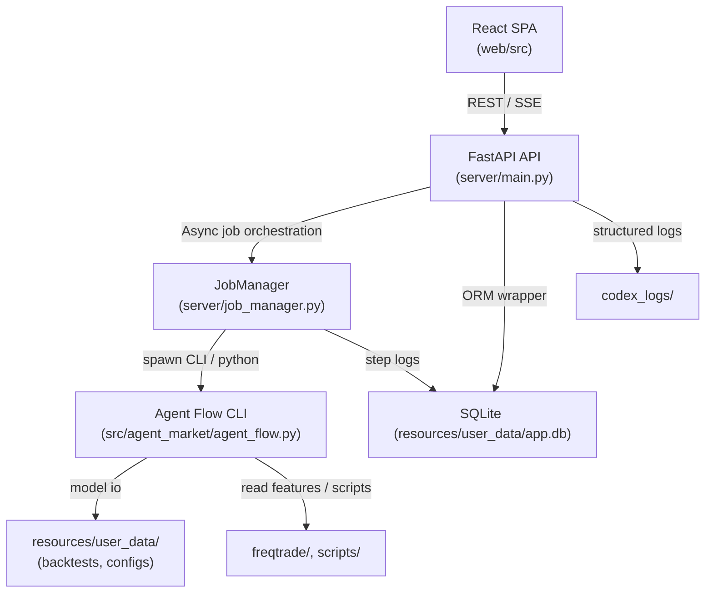

# Current Architecture

## Runtime Topology

## Core Components
- **FastAPI service (`server/main.py`)** – exposes configuration, expression editing, job control, and health endpoints on port `8032`. Injects a shared `DB` instance and streams job logs via Server-Sent Events.
- **JobManager (`server/job_manager.py`)** – maintains subprocess lifecycles, captures stdout/stderr, throttles concurrent jobs, and records milestones through `_on_job_step`.
- **Workflow runners (`src/agent_market/agent_flow.py`, `scripts/*`)** – orchestrate feature extraction, expression generation (LLM or heuristic), ML/AutoML training, and backtests by shelling into the freqtrade toolchain.
- **Front-end (`web/`)** – Vite + React SPA consuming `/expressions`, `/config`, `/run/*`, `/jobs/*` APIs. Uses long polling/SSE to reflect job progress and read backtest summaries.
- **Data plane** – SQLite at `resources/user_data/app.db` stores lightweight metadata (agents, orders, job steps). Bulk artefacts live under `resources/user_data/` (backtest zips, expression files) and `resources/data/` (raw/clean OHLCV). Log rotation points to `codex_logs/`.

## Request Lifecycle
1. The browser issues REST calls to FastAPI (e.g. `POST /run/backtest`).
2. `server/main.py` validates payloads, persists job metadata, and delegates to `JobManager`.
3. `JobManager` spawns the appropriate CLI (Python module or script), streaming stdout lines to log files and SSE clients (`GET /jobs/{id}/stream`).
4. Subprocesses read/write under `resources/user_data/` and `resources/data/`. They emit structured JSON back to the API when possible.
5. Completion/failure updates propagate through SQLite tables so the UI can refresh job lists.

## Dependencies & Ports
- **API** – listens on `127.0.0.1:8032` by default, configurable with `APP_HOST`/`APP_PORT`.
- **Python** – requires 3.11+, `freqtrade` Conda env for heavy ML tasks.
- **Node** – Node 20+ for Vite dev server, bundling, and lint/format tasks.
- **External services** – none bundled; integrations (e.g., exchanges, Telegram) are decoupled via connectors still under development.

## Future Hooks
- Expand `JobManager` to persist per-task metrics once runtime DAG support (TODO-07/08) lands.
- Replace SQLite with Postgres and add message queue brokers when multi-worker scheduling is introduced (TODO-10/40).
