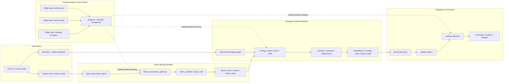
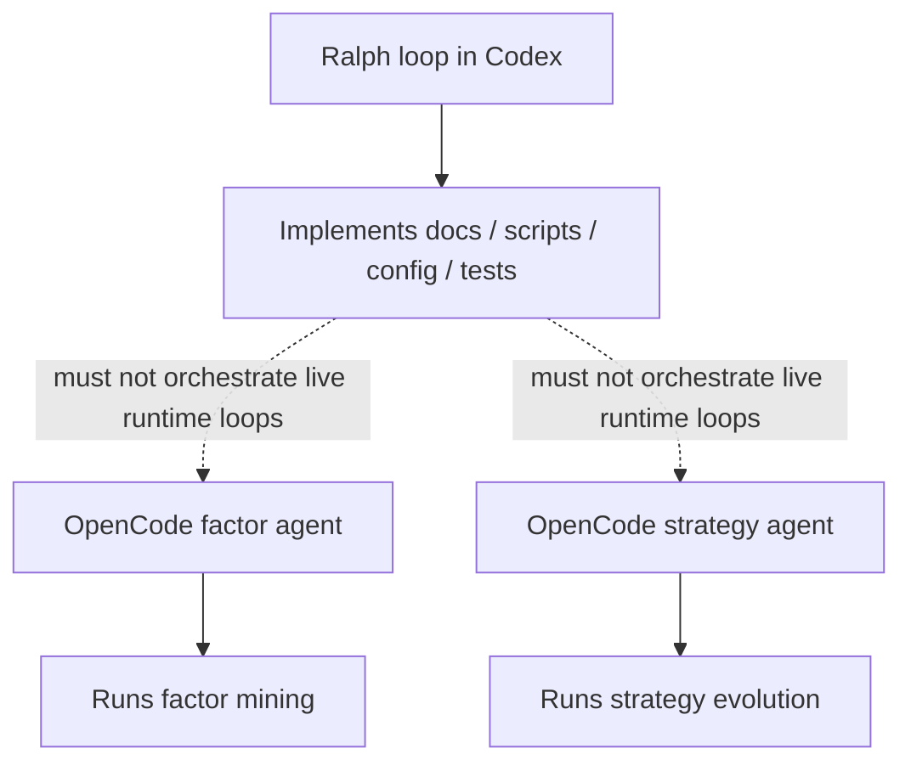

# OpenCode Strategy Factory Architecture

## Goal

把当前仓库整理成一个明确分层的策略工厂：

- 运行时平面：
  - 因子挖掘直接由 `OpenCode agent` 驱动
  - 策略挖掘进化直接由 `OpenCode agent` 驱动
- 开发平面：
  - `Ralph loop` 只负责持续实现和收口架构 backlog
  - 不参与运行时挖掘执行

这两层必须分开，否则运行链会把实现 loop 和研究 loop 混在一起。

## Repo Mapping

### 因子挖掘平面

- Flow entry: [scripts/agent_flow.py](../scripts/agent_flow.py)
- Flow runtime: [src/agent_market/agent_flow.py](../src/agent_market/agent_flow.py)
- Expression / factor miner: [scripts/freqai_expression_agent.py](../scripts/freqai_expression_agent.py)
- LLM transport: [src/agent_market/freqai/llm.py](../src/agent_market/freqai/llm.py)
- Factor compile / eval dispatch: [src/agent_market/flow_ext/step_dispatch.py](../src/agent_market/flow_ext/step_dispatch.py)

### 策略进化平面

- Strategy miner entry: [scripts/strategy_miner.py](../scripts/strategy_miner.py)
- Strategy runtime: [src/agent_market/strategy_miner/runner.py](../src/agent_market/strategy_miner/runner.py)
- Agent adapter: [src/agent_market/strategy_miner/agent_adapter.py](../src/agent_market/strategy_miner/agent_adapter.py)
- Agent executor: [src/agent_market/agents/executor.py](../src/agent_market/agents/executor.py)
- OpenCode transport: [src/runner_fsm/opencode/client.py](../src/runner_fsm/opencode/client.py)

### 开发 / 收口平面

- Repo-local Ralph loops: [.codex/ralph](../.codex/ralph)
- Bootstrap script: [scripts/bootstrap_strategy_factory_loops.py](../scripts/bootstrap_strategy_factory_loops.py)

## Target Architecture



## Runtime Separation



## Execution Model

### 1. 因子挖掘

运行时直接用 `OpenCode agent` 做表达式/因子发现：

- `scripts/freqai_expression_agent.py --llm-provider opencode`
- OpenCode 负责：
  - 阅读特征定义
  - 生成表达式
  - 迭代避开已失败表达式
  - 输出严格 JSON

推荐入口配置：

- [configs/agent_flow_kucoin_factor_opencode.json](../configs/agent_flow_kucoin_factor_opencode.json)

推荐命令：

```bash
python3 scripts/agent_flow.py \
  --config configs/agent_flow_kucoin_factor_opencode.json \
  --steps feature expression ml backtest
```

### 1b. Unified Strategy Factory Run

如果你要把 `factor flow -> strategy miner -> replay/promotion artifacts` 合成一条正式生产链，
现在可以直接用单个 `AgentFlow` 顶层 config：

- [configs/agent_flow_strategy_factory_example.json](../configs/agent_flow_strategy_factory_example.json)
- operator runbook: [docs/strategy_factory_operator_runbook.md](./strategy_factory_operator_runbook.md)

运行后会自动补：

- factor-memory 注入 strategy miner
- `experiment_registry.jsonl`
- `budget_plan.json`
- `replay_manifest.json`
- `lineage_graph.json`
- `promotion_chain.json`
- `resource_dashboard.json`

### 2. 策略进化

运行时直接用 `OpenCode agent` 做策略生成、修复、回测推进：

- `scripts/strategy_miner.py`
- `budget.provider=opencode`
- runtime config 通过 renderer 从现有 alpha config 派生，避免污染正在使用的 openai-compatible 配置

推荐命令：

```bash
python3 scripts/make_strategy_miner_opencode_config.py \
  --base configs/strategy_miner_alpha_spot_core.json \
  --output runtime_configs/strategy_miner_alpha_spot_core_opencode.json

python3 scripts/strategy_miner.py \
  --config runtime_configs/strategy_miner_alpha_spot_core_opencode.json
```

## Budget Allocation

推荐把预算分成两层。

### 研究预算

每 100 单位研究预算建议这样分：

- 25: 因子挖掘 discovery
- 10: 因子 compile / eval / scoring
- 35: 策略进化 discovery + repair + hyperopt
- 15: benchmark / holdout / robustness
- 10: portfolio / promotion / shadow
- 5: 运行观测与 replay

### 标的预算

每 100 单位运行预算再按市场拆：

- 55: 现货
- 45: 期货

当前理由：

- 现货 ML family 已经先跑出有效盆地
- 期货 rule breakout / pullback 已经起量，但还在继续稳定化

## Artifact Contract

### 因子层

最少要稳定产出：

- `user_data/freqai_expressions_*.json`
- `*_scored_all.json`
- `factor_scores.json`
- `factor_pareto.csv`
- `factor cards`

### 策略层

最少要稳定产出：

- `checkpoint.json`
- `leaderboard.json`
- `strategy_cards/`
- `failure_cards/`
- `promotion_log.jsonl`

## Ralph Loop Scope

Ralph loop 只干下面这些事：

- 维护架构图和预算策略
- 逐步实现因子挖掘 backlog
- 逐步实现策略进化 backlog
- 每轮写 progress / handoff / acceptance

Ralph loop 不做这些事：

- 不直接替代 OpenCode runtime
- 不直接承担 factor mining 或 strategy mining 的研究执行
- 不把运行时 agent 再包一层 loop

## Immediate Backlog

### Architecture loop

- 维护这份架构文档
- 追踪分层边界是否被破坏
- 维护预算与 promotion contract

### Factor-mining loop

- 强化 OpenCode factor agent 提示词
- 沉淀 factor cards / failure cards
- 接通 factor compile/eval 到统一 artifact 面

### Strategy-evolution loop

- 扩展 strategy family IR
- 强化 holdout / benchmark / portfolio
- 收敛 futures family 的 discovery 效率
